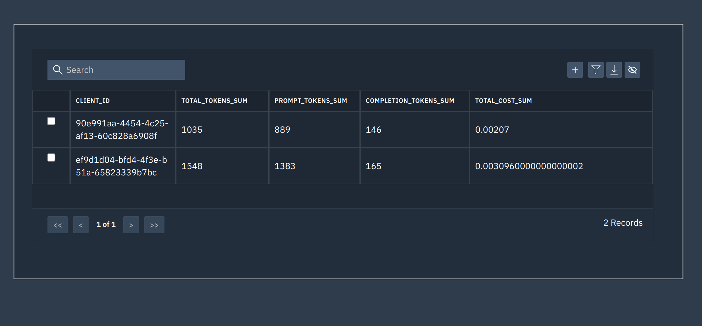

# Production level scalable Documents ChatBot with a customizable dashboard

## About
ChatBot to do conversation based on stored data provided by the user. Here is flow diagram


Here are few advantages.
* The chatBot uses a Retriever-Generator base module to reduce costs. The Retriever fetches the text of concern while the Generator creates a response from the fetched content.
* OpenAI GPT3.5, and open-source models are supported
* Embeddings are created  and stored in a Milvus vector database.
* History is stored in PostgreSQL

## Prerequisite
* Install [docker engine](https://docs.docker.com/engine/install/ubuntu/#install-using-the-repository)
* Install [docker compose](https://docs.docker.com/compose/install/linux/#install-using-the-repository)
* Install and run [milvus](https://milvus.io/docs/install_standalone-docker.md). See guide to run for more info.  
* Install and run [tooljet](https://docs.tooljet.com/docs/setup/docker/). See guide to run for more info.  
* Install [langchain](https://python.langchain.com/en/latest/index.html) / [LlamaIndex](https://gpt-index.readthedocs.io/en/latest/)
* Download open-source model weights from [GPT4All](https://gpt4all.io/index.html) and place in llms folder. The models I have tested is 
    
    * ggml-gpt4all-j.bin (commercial licensable)     
    * ggml-gpt4all-l13b-snoozy.bin (non-commercial licensable)
* Put openAI API key in `example.env` in case if you want to use openAI model and replace `example.env` to `.env`
 # Dashbaord
Dashboard is accessible at port 8005.  
This is simplest dashboard that display the usage.




# API Documentation

This documentation provides information about the API endpoints available in the FastAPI-based API.

## Models

### DocModel

Represents the model for adding documents for ingestion.

| Field           | Type             | Description                                                |
| --------------- | ---------------- | ---------------------------------------------------------- |
| urls        | list[str]              | List having urls of doc files.              |
| embeddings_name | str (optional) | The name of the embeddings ['openai', 'sentence'] (default: 'openai').      |
| client_id | EmailID   | Email ID of the user (server as a collection ID in milvus) |
| drop_existing_embeddings | bool (optional) | Whether to drop existing embeddings (default: False).    |

### QueryModel

Represents the model for processing user queries.

| Field           | Type                                       | Description                                                |
| --------------- | ------------------------------------------ | ---------------------------------------------------------- |
| text            | str                                        | The text for the query.                                    |
| session_id      | uuid4                                        | The session ID for the query.                              |
| llm_name        | str (optional) | The name of the language model ['openai', 'llamacpp', 'gpt4all'] (default: 'openai').       |
| client_id | EmailID   | Email ID of the user (server as a collection ID in milvus) |

### DeleteSession

Represents the model for deleting a session from the database.

| Field             | Type              | Description                                   |
| ----------------- | ----------------- | --------------------------------------------- |
| session_id        | uuid4               | The session ID to delete.                     |

## Endpoints

### `POST /doc_ingestion`

Endpoint to add documents for ingestion.

#### Request

- Body Parameters:
  - `doc` (DocModel): The document ingestion details.

#### Response

- Status Code: 200 (OK)
- Body: `{"message": "Documents added successfully"}`

### `POST /query`

Endpoint to process user queries.

#### Request

- Body Parameters:
  - `query` (QueryModel): The user query details.

#### Response

- Body: `{"answer": str, "cost": dict, "source":list}`
```
-- answer : answer from the documents
-- cost "cost": {
    "successful_requests": int,
    "total_cost": float,
    "total_tokens": int,
    "prompt_tokens": int,
    "completion_tokens": int
  },
  --source: list of str showing source of extracted answer
```
### `POST /delete`

Endpoint to delete a session from the database.

#### Request

- Body Parameters:
  - `session` (DeleteSession): The session deletion details.

#### Response

- Body: The response message indicating the success or failure of the deletion operation.

## Example Usage

### Adding Documents for Ingestion

```bash
$ curl -X 'POST' \
  'http://0.0.0.0:8000/doc_ingestion' \
  -H 'accept: application/json' \
  -H 'Content-Type: application/json' \
  -d '{
  "urls": [
    "https://raw.githubusercontent.com/talhaanwarch/doc_chat_api/main/data/0.txt"
  ],
  "client_id": "admin@admin.com",
  "embeddings_name": "openai",
  "drop_existing_embeddings": false
}'
```

### Processing User Queries

```bash
$ curl -X 'POST' \
  'http://0.0.0.0:8000/query' \
  -H 'accept: application/json' \
  -H 'Content-Type: application/json' \
  -d '{
  "text": "What is quadratic funding?",
  "session_id": "824dcfc3-9ee2-40d7-bb2e-693fbc7696ca",
  "client_id": "admin@admin.com",
  "llm_name": "openai"
}'
```

### Deleting a Session

```bash
$ curl -X POST -H "Content-Type: application/json" -d '{
    "session_id": "9c17659b-f3f6-45c5-8590-1a349102512b"
}' http://localhost:8000/delete
```


# Guide to run
```
docker compose -f docker-compose.milvus.yml up --build -d
docker compose -f docker-compose.app.yml up --build -d
docker compose -f docker-compose.tooljet.yml up --build -d
```


# Note:
The Chatbot is also implemented using [haystack](https://github.com/talhaanwarch/openai-chatbot/tree/haystack)
